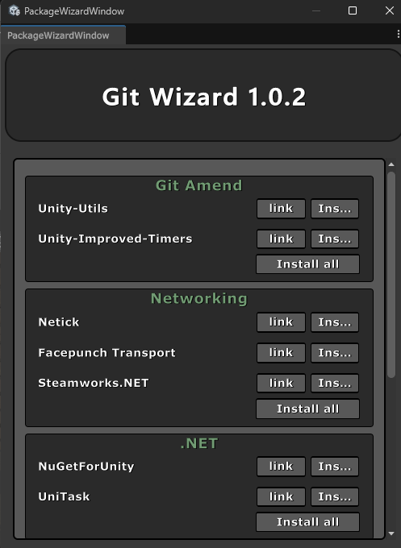
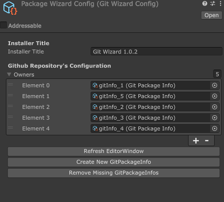
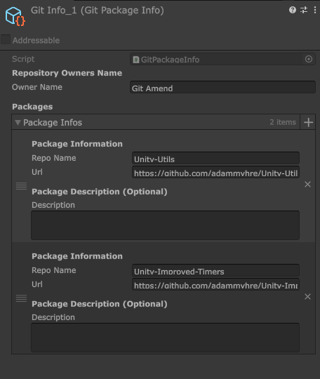

# TCS GitWizard

   

[](https://discord.gg/knwtcq3N2a) 

---

# Overview

**TCS GitWizard** is a Unity plugin to centralize management of Git repository URLs for Unity projects. It allows developers to store and manage all Git URLs in one place, simplifying project setups and reducing manual work. By integrating into the Unity Editor, it streamlines handling Git-based package links.

The primary purpose is to centralize Git-based Unity packages, much like the Unity Package Manager for store assets. This plugin automates installation, updates, and management of packages via a unified interface, making it particularly useful for teams.

---

# Features

- **Centralized Package Management**: Manage all Git URLs in one place.
- **Efficient Package Handling**: Easily add, update, or remove Git-based Unity packages.
- **Custom Editor Interface**: User-friendly interface for managing packages in Unity.
- **UI Toolkit Integration**: Built with Unity's UIToolkit for a modern UI.

---

# Getting Started

## Prerequisites

- **Unity Version**: Compatible with Unity 2021.3 or higher.
- **Git**: Ensure Git is installed and accessible in your system's PATH.

## Installation

1. **Clone the Repository**: Clone this repository into your Unity project within `Assets/Plugins`.

   ```bash
   git clone https://github.com/Ddemon26/TCS-GitWizard.git Assets/Plugins/TCS-GitWizard
   ```

2. **Open Unity**: Open Unity. The GitWizard tool will be accessible via the Tools menu.

---

# Usage

- **Opening GitWizard**: Navigate to `Tools > TCS GitWizard` within Unity.




- **Adding a Package**: Click "Add Package" to add a new Git-based package using the repository URL.



---

# Configuration

- **PackageWizardConfig.asset**: Stores settings like default branches, authentication methods, and package preferences.



---

# Contribution

Contributions are encouraged! To contribute:

1. Fork the repository.
2. Create a feature branch.
3. Commit changes with descriptive messages.
4. Submit a pull request.

Please follow coding standards and provide relevant documentation.

---

# License

This project is licensed under the MIT License. Refer to the [LICENSE](LICENSE) file for details.

---

# Acknowledgements

- **Unity UIToolkit**: For the UI framework.
- **Git for Unity**: For inspiring Git package management in Unity.

---

# Support

For issues or questions, open an issue on the [GitHub Issues](https://github.com/Ddemon26/TCS-GitWizard/issues) page.

---

Customize TCS GitWizard to fit your needs. We hope it enhances your Unity package management experience, making your workflow more efficient.

